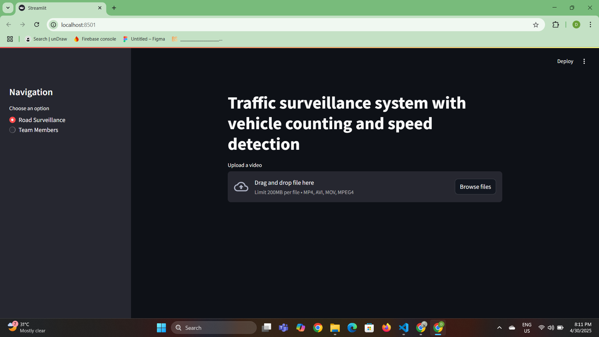
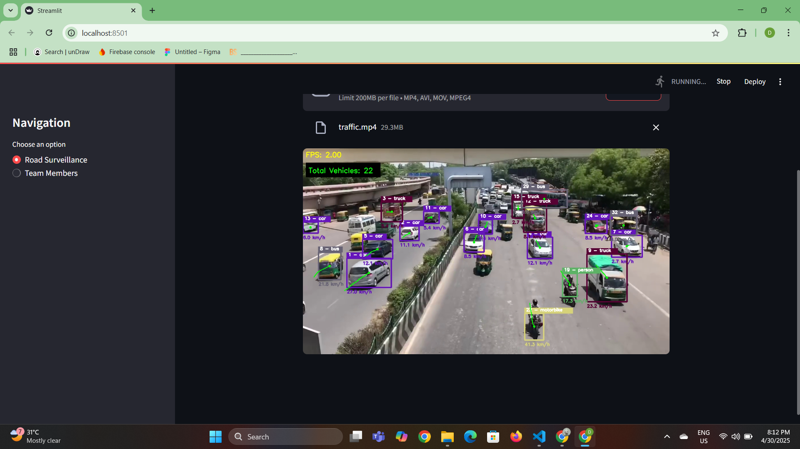

1.use Python 3.12.9 version

2.create environment:
python -m venv env

3.use created environment:

env\Scripts\activate

4. install required packages
pip install streamlit opencv-python ultralytics numpy filterpy scipy scikit-learn tensorflow

5. Run app:
streamlit run app.py

examples:

